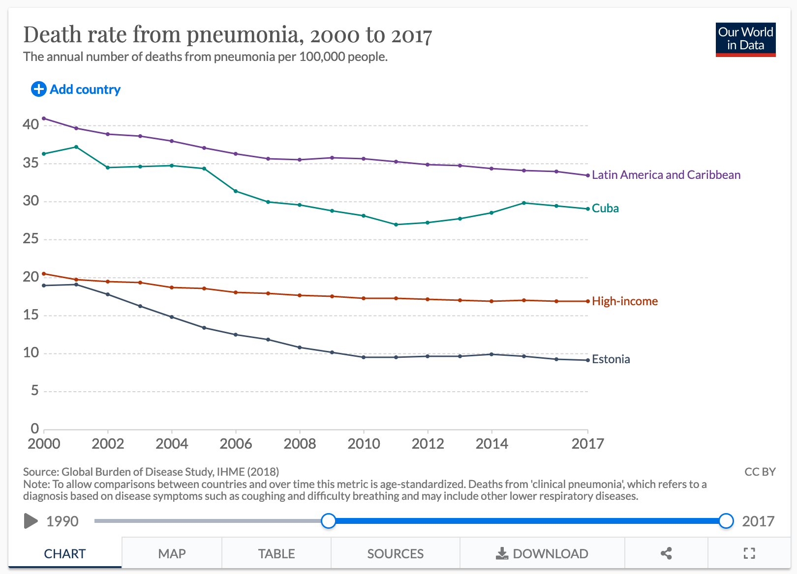

**Entrega:** Enviar la carpeta que el codigo de solución (.Rmd y funciones
auxiliares) a mas tardar el 15 de Diciembre antes de las 12:00pm (mediodia), por
correo electrónico con el título fundamentos-final, un solo documento por
equipo. No se aceptarán entregas extemporáneas. Será mejor entregar un examen
resuelto parcialmente, que no entregar nada.

**Instrucciones:**
  
* Tus respuestas deben ser claras y debes explicar los resultados, incluye
también tus procedimientos/código de manera ordenada, y el código comentado.

* Se evaluará la presentación de resultados (calidad de las gráficas, tablas,
...), revisa la sección de visualización en las notas.

* Las sesiones del Martes 8 y Jueves 10 de Diciembre a las 10 am, serán espacios
para resolver dudas que puedan surgir del exámen.

* No pueden compartir soluciones entre diferentes equipos, o alumnos del grupo
001 de esta misma materia.

* Al entregar este examen afirmas que el trabajo se realizó sólo con tu
compañero de equipo. El material que utilizaste para apoyarte consistió de las
notas en clase (pdf en canvas), el codigo fuente de las notas en el repositorio
de Github.

* Al entregar estás dando tu consentimiento para que bajo sospecha y suficiente
evidencia de copia se anule tu evaluación.

# Preparación de ambiente

Asegurate de tener instalado los paquetes que usamos más en las notas del curso. 
En particular, si usas `renv` como manejador de ambientes puedes instalarlos con 
las instrucciones de abajo. Sólo necesitarías descomentarlas.

```{r, echo = TRUE}
# renv::install("tidyverse")
# renv::install("patchwork")
# renv::install("nullabor")
# renv::install("scales")
#renv::install('diegovalle/mxmaps')
# renv::install("nleqslv")
# renv::snapshot()

# Escribe las claves unicas de ambos miembros del equipo, para generar una
# semilla de numeros aleatorios.
claves_unicas <- c(1, 197860)
set.seed(min(claves_unicas))
```

  
```{r, echo=FALSE, message=FALSE, warning=FALSE}
library(tidyverse)
library(patchwork)
library(nullabor)
library(mxmaps)
library(scales)
library(nleqslv)
knitr::opts_chunk$set(echo = TRUE, message = FALSE, warning=FALSE, 
                      fig.align = 'center', cache=TRUE, fig.height = 3,
                      out.width =  "99%")
comma <- function(x) format(x, digits = 2, big.mark = ",")
```
 
 
# Modelos de conteo 

En el curso hemos estudiado las variables aleatorias Gaussianas para modelar
eventos aleatorios compuestos de pequeños, pero controlados, efectos. También 
hemos utilizado variables aleatorias Binomiales para modelar tasas de éxito de
algún evento binario de interés. En el contexto Bayesiano, hemos utilizado las 
distribuciones Beta, Gamma-Inversa, y Normal para realizar análisis conjugado 
con estos modelos. 

En este mini-proyecto, ilustraremos otra familia de distribuciones muy comunes
en la práctica. En particular, veremos la distribución **Poisson** como un
modelo de conteo. Es decir, una variable aleatoria Poisson nos sirve para
modelar el número de ocurrencias de un evento en un periodo (tiempo) o área
(espacio) base.

Decimos que $x|\theta \sim \textsf{Poisson}(\theta)$ si los eventos ocurren de
manera independiente y a una tasa constante. La función de masa de probabilidad 
esta dada por

$$ p(X = k \, | \, \theta) = \frac{\theta^k \, e^{-\theta}}{k!},$$

donde sabemos que 

$$ \mathbb{E}[x|\theta] = \theta, \qquad  \mathbb{V}[x|\theta] = \theta $$

Al examinar la base de la función de masa de probabilidad notamos que un 
candidato para un anålisis conjugado es una distribución Gamma. Es decir, 
un candidato *natural* para una distribución previa para $\theta$ es 

$$\theta \sim \textsf{Gamma}(\alpha, \beta),$$

donde la densidad está dada por

$$ p(\theta) \propto \theta^{\alpha - 1} \, e^{-\beta \, \theta},$$

y tenemos los siguientes momentos 

$$\mathbb{E}[\theta] = \frac\alpha\beta, \qquad  \mathbb{V}[\theta] = \frac{\alpha}{\beta^2}.$$ 

---

**Pregunta 1)** Para una muestra $X_1, \ldots, X_n \overset{iid}{\sim} \textsf{Poisson}(\theta),$ 
determina la distribución posterior de $\theta,$ y calcula media y varianza de
la distribución posterior. ¿Podríamos escribir la media posterior como un
promedio ponderado entre datos e información previa? ¿Cómo interpretas los
hiper-parámetros $(\alpha, \beta)?$

*Utilizando la regla de bayes para calcular la posterior, se tiene:*
$$P(\theta | X) = \frac{P(X | \theta) P(\theta)}{P(X)}$$
*Como sabemos que podemos omitir la constante de proporcionalidad, entonces quedaría:*
$$P(\theta | X) \propto P(X | \theta) P(\theta)$$
*Entonces, para calcular la posterior debemos calcular la verosimilitd y la distribución inicial. Sabemos la distribución inicial es una Gamma, por lo tanto:*
$$P(\theta) \propto \theta^{\alpha - 1} \, e^{-\beta \, \theta} $$
*Revisando las notas de clase (15-02-fundamentos-estadistica.pdf) encontramos las constantes de la función de densidad de la distribución Gamma:*
$$P(\theta) = \frac{\beta^{\alpha}}{\Gamma(\alpha)} \theta^{\alpha - 1} \, e^{-\beta \, \theta}$$

*Mientras que para la verosimilitud se tiene:*
$$P(X | \theta) = {\displaystyle \prod_{i=1}^{n} p(y_i | \theta)}
= {\displaystyle \prod_{i=1}^{n}} \frac{\theta^{y_i} \, e^{-\theta}}{y_i!}
= \frac{{\displaystyle \prod_{i=1}^{n} \theta^{y_i}} {\displaystyle \prod_{i=1}^{n}e^{-\theta}}}{{\displaystyle \prod_{i=1}^{n}y_i!}}
\propto {\displaystyle \prod_{i=1}^{n} \theta^{y_i}} {\displaystyle \prod_{i=1}^{n}e^{-\theta}}
= \theta^{\sum_{i=1}^{n} y_i} e^{-n \theta}$$
$$\Rightarrow P(X | \theta) \propto \, \theta^{\sum_{i=1}^{n} y_i} e^{-n \theta}$$

*Entonces, la distribución posterior resulta:*
$$P(\theta | X) \propto \theta^{\alpha - 1} \, e^{-\beta \, \theta} \, \theta^{\sum_{i=1}^{n} y_i} e^{-n \theta} = \theta^{\alpha - 1 + \sum_{i=1}^{n} y_i} e^{-(\beta + n) \, \theta}$$
*Así, las reglas de actualización:*
$$\alpha_1 = \alpha + \sum_{i=1}^{n} y_i$$
$$\beta_1 = \beta + n$$
*Como la posterior también es una distribución Gamma entonces la media y la varianza resultan:*
$$\mathbb{E}[\theta | X] = \frac{\alpha + \sum_{i=1}^{n} y_i}{\beta + n} = \frac{\alpha}{\beta + n} + \frac{\sum_{i=1}^{n} y_i}{\beta + n} = \frac{\beta}{\beta + n} \frac\alpha\beta + \frac{n}{\beta + n} \frac{\sum_{i=1}^{n} y_i}{n} = \frac{\beta}{\beta + n} \, \mathbb{E}[\theta] + \frac{n}{\beta + n} \, \bar{y}$$
*Por lo tanto, sí podemos escribir la media posterior como el promedio ponderado de la media de la distribución previa y la media obtenida de los datos. Mientras que para la varianza:*
$$\mathbb{V}[\theta] = \frac{\alpha + \sum_{i=1}^{n} y_i}{(\beta + n)^2}$$

*DUDA*
*NO SË QUE REPRESENTAN ALPHA Y BETA, exitos y fracasos?...*
---

Otra variable aleatoria de conteo relevante es la **Binomial Negativa.** Esta 
distribución sirve para modelar el número de éxitos en una secuencia de experimentos 
Bernoulli antes de encontrar un número específico de fracasos. 

Decimos que $X|\alpha, \beta \sim \textsf{Neg-Bin}(\alpha, \beta),$ donde $X$ es
el número de éxitos que contamos antes de $\alpha$ fracasos, cuando cada fracaso
ocurre con probabilidad $\frac{\beta}{\beta + 1}.$ La función de masa de
probabilidad se escribe

$$ p(X = k \, | \, \alpha, \beta) = {\alpha + k -1 \choose k} \left(\frac{\beta}{\beta + 1}\right)^\alpha \left(\frac{1}{\beta + 1}\right)^k.$$

Nota que 
$${\alpha + k -1 \choose k} = {\alpha + k -1 \choose \alpha -1},$$
es decir, el número de formas que puedes acomodar $\alpha - 1$ fracasos es igual al
número de formas que puedes acomodar $k$ éxitos cuando realizaste $\alpha + k-1$
experimentos y todos los experimentos son independientes. Por otro lado, la
definición es
$${\alpha + k -1 \choose k} = \frac{(\alpha + k - 1)!}{k! \, (\alpha - 1)!}.$$
donde $k! = k \times k-1 \times k-2 \times \cdots \times 1,$ y la función Gamma satisface
$$\Gamma(\alpha) = (\alpha - 1)!.$$

---

**Pregunta 2)** Bajo el modelo conjugado que escribiste en la pregunta 1, calcula 
la **distribución predictiva previa** para una observación Poisson. Es decir,
calcula 
$$p(y) = \int \textsf{Poisson}(y \,| \,\theta) \textsf{Gamma}(\theta \, | \, \alpha, \beta) \, \text{d}\theta.$$

*Sustituyendo las funciones de densidad de probabilidad de cada una de las distribuciones:*
$$p(y)
= \int \frac{\theta^k \, e^{-\theta}}{k!} \frac{\beta^{\alpha}}{\Gamma(\alpha)} \theta^{\alpha - 1} \, e^{-\beta \, \theta} d\theta
= \frac{\beta^{\alpha}}{\Gamma(\alpha)k!} \int \theta^k \, e^{-\theta} \theta^{\alpha - 1} \, e^{-\beta \, \theta} d\theta
= \frac{\beta^{\alpha}}{\Gamma(\alpha)k!} \int \theta^{\alpha + k -1} \, e^{-(\beta+1)\theta} d\theta$$
*La última igualdad tiene la forma de una distribución Gamma con parámetros:*
$$\alpha' = \alpha + k$$
$$\beta' = \beta + 1$$
*Sólo falta añadirle las constantes de normalización:*
$$p(y) = \frac{\beta^{\alpha}}{\Gamma(\alpha)k!} \int \theta^{\alpha + k -1} \, e^{-(\beta+1)\theta} d\theta = \frac{\beta^{\alpha}}{\Gamma(\alpha)k!} \int \frac{(\beta+1)^{\alpha+k}}{\Gamma(\alpha+k)} \frac{\Gamma(\alpha+k)}{\beta+1)^{\alpha+k}} \theta^{\alpha - 1} \, e^{-\beta \, \theta} d\theta$$
$$\Rightarrow p(y) = \frac{\beta^{\alpha}}{\Gamma(\alpha)k!} \frac{\Gamma(\alpha+k)}{(\beta+1)^{\alpha+k}} \int \frac{(\beta+1)^{\alpha+k}}{\Gamma(\alpha+k)} \theta^{\alpha - 1} \, e^{-\beta \, \theta} d\theta = \frac{\beta^{\alpha}}{\Gamma(\alpha)k!} \frac{\Gamma(\alpha+k)}{(\beta+1)^{\alpha+k}} \int \textsf{Gamma}(\theta \, | \, \alpha', \beta') d\theta$$
$$\Rightarrow p(y) = \frac{\beta^{\alpha}}{(\beta+1)^{\alpha+k}} \frac{\Gamma(\alpha+k)}{\Gamma(\alpha)k!} = \left(\frac{\beta}{\beta + 1}\right)^\alpha \left(\frac{1}{\beta + 1}\right)^k \frac{(\alpha+k-1)!}{(\alpha-1)!k!}$$
*Finalmente,*
$$\Rightarrow p(y) = {\alpha + k -1 \choose k} \left(\frac{\beta}{\beta + 1}\right)^\alpha \left(\frac{1}{\beta + 1}\right)^k$$
*Por lo tanto, la distribución predictiva previa de una distribución Poisson-Gamma es una Bonimial Negativa.*

Verifica tu cálculo utilizando las reglas probabilidad condicional. En especifico,
utiliza

$$ p(y) = \frac{p(y|\theta)p(\theta)}{p(\theta|y)}.$$
*Teniendo en cuenta que para calcular la posterior se usó la distribución Gamma con las reglas de actualización para una y obternidas en la pregunta 1:*
$$\alpha_1 = \alpha + y$$
$$\beta_1 = \beta + 1$$
*Entonces podemos sustituir en la regla de bayes nuestros resultados anteriores, tomando y = k.*
$$p(y) = \frac{\frac{\theta^k \, e^{-\theta}}{k!} \, \frac{\beta^{\alpha}}{\Gamma(\alpha)} \theta^{\alpha - 1} \, e^{-\beta \, \theta}}{\frac{(\beta+1)^{\alpha+k}}{\Gamma(\alpha+k)}\theta^{\alpha - 1 + k} \, e^{-(\beta + 1) \, \theta}} = \frac{\beta^{\alpha}\,\Gamma(\alpha+k)}{(\beta+1)^{\alpha+k}\,\Gamma(\alpha)\,k!} \frac{\theta^k \, e^{-\theta}\theta^{\alpha - 1} \, e^{-\beta \, \theta}}{\theta^{\alpha - 1 + k} \, e^{-(\beta + 1) \, \theta}} = \frac{\beta^{\alpha}\,\Gamma(\alpha+k)}{(\beta+1)^{\alpha+k}\,\Gamma(\alpha)\,k!} \frac{\theta^k \, \theta^{\alpha - 1}}{\theta^{\alpha - 1 + k}} = \frac{\beta^{\alpha}\,\Gamma(\alpha+k)}{(\beta+1)^{\alpha+k}\,\Gamma(\alpha)\,k!}$$
$$\Rightarrow p(y) = \left(\frac{\beta}{\beta + 1}\right)^\alpha \left(\frac{1}{\beta + 1}\right)^k \frac{(\alpha+k-1)!}{(\alpha-1)!\,k!} = \left(\frac{\beta}{\beta + 1}\right)^\alpha \left(\frac{1}{\beta + 1}\right)^k {\alpha + k -1 \choose k}$$

¿Qué distribución marginal tiene $y$ bajo el modelo conjugado?
*Una Binomial Negativa*

---

En la práctica, es útil extender el modelo Poisson como sigue
$$\begin{align}
  x_i | t_i, \theta &\sim \textsf{Poisson}(\lambda_i), \\
  \lambda_i &= t_i \theta, 
\end{align}$$

donde la tasa de ocurrencia $\lambda_i$ ha sido descompuesta en un producto que
incorpora la exposición $t_i$ y una tasa de ocurrencia por unidades expuestas
$\theta.$ En este contexto usualmente tenemos observaciones para $x_i$ y $t_i$
pues conocemos el parámetro de exposición. Por ejemplo, si $x_i$ es el número de
personas que se enferman de gripe en la $i$-ésima ciudad en un año, entonces $\theta$
denota la tasa anual por persona de enfermarse de gripe en una población de tamaño
$t_i$.


--- 

**Pregunta 3)** Supongamos que tenemos datos $X_1, \ldots, X_n \sim
\textsf{Poisson}(\lambda_i),$ con $\lambda_i = t_i \theta$ para $i = 1, \ldots,
n.$ Utilizando el modelo conjugado, ¿cuál es la distribución posterior de
$\theta?$


$$ p(X = k \, | \, \theta,t_i) = \frac{(\theta t_i)^k \, e^{-\theta t_i}}{k!},$$

$$ p(\theta) \propto \theta^{\alpha - 1} \, e^{-\beta \, \theta},$$


$$P(X | \theta) = {\displaystyle \prod_{i=1}^{n} p(y_i | \theta)}
= {\displaystyle \prod_{i=1}^{n}} \frac{(\theta t_i)^{y_i} \, e^{-(\theta t_i)}}{y_i!}
= \frac{{\displaystyle \prod_{i=1}^{n} (\theta t_i)^{y_i}} {\displaystyle \prod_{i=1}^{n}e^{-(\theta t_i)}}}{{\displaystyle \prod_{i=1}^{n}y_i!}} \propto \theta^n \prod_{i=1}^{n} t_i^{y_i}e^{-\theta\sum^n_{i=1}t_i}
$$


$$P(\theta | X,T)\propto\theta^n \prod_{i=1}^{n} t_i^{y_i}e^{-\theta\sum^n_{i=1}t_i}\theta^{\alpha - 1} \, e^{-\beta \, \theta}=
\prod_{i=1}^{n} t_i^{y_i}\theta^{\alpha +n - 1}e^{- \theta(\beta +\sum^n_{i=1}t_i )}

$$
La distribución posterior de $\theta|X,T \propto Gamma(\alpha',\beta')$ con


$$\alpha'=\alpha+n$$
$$\beta'=\beta+\sum^n_{i=1}t_i$$


---

# Caso de estudio: Tasas de mortalidad

El INEGI publica para cada año los registros de fallecimiento junto con la causa
principal de muerte. En esta sección utilizaremos los modelos descritos
anteriormente para inferir tasa de fallecimiento por Neumonía para cada uno de
los municipios/delegaciones del país. Contamos con los últimos 5 años de los
registros de defunción.

---

### Carga y preparación de datos


**Pregunta 4)** Empecemos explorando los datos. Carga los datos para un año que
elijas. Encontrarás en los archivos en `datos/poblacion/defunciones/<año>` los
registros de defunciones por Neumonía para el `<año>` que escojas.

```{r carga defunciones de un año}
anio<-2019
path<-paste("datos_examen/poblacion/defunciones/",anio,"/defunciones_registradas.csv",sep="")
defunciones<-read_csv(path)

defunciones_tran<-defunciones
defunciones_tran$contador<-1      


defunciones_tran<-defunciones_tran%>%
                      select(entidad,municipio,edad_grupos,contador)%>%
                      pivot_wider(id_cols=c("entidad","municipio"),
                                  names_from="edad_grupos",
                                  names_prefix="muertos_neumonia_",
                                  values_from="contador",
                                  values_fn=sum)


defunciones_tran
defunciones

```

**Pregunta 5)** De igual forma, carga los datos de población que encontrarás en
`datos_examen/poblacion/demograficos`. Por el momento, no necesitamos los grupos
de edad (aunque despúes los utilizaremos). Por ahora escribe el codigo necesario 
para calcular el tamaño de la población en cada uno de los municipios.


```{r carga demograficos}
path_dem<-"datos_examen/poblacion/demograficos/poblacion_municipios_edad.csv"
demograficos<-read_csv(path_dem)
#colnames(demograficos)<-c("entidad","nom_ent", "municipio","nom_mun","[0,3)" ,"[3,6)",  "[6,12)", "[12,18)",  "[18,25)",  "[25,64)" , "[64,Inf]")
demograficos<-demograficos%>%
                    mutate(pob_total=p_0a2+p_3a5+p_6a11+p_12a17+p_18a24+p_25a64+pob65_mas)
demograficos
```

**Pregunta 6)** Ahora necesitamos *cruzar* las tablas de defunciones y población para crear una 
tabla con ambos registros. Para esto necesitarás la función `dplyr::full_join`.


```{r cruce defunciones y poblacion}


dplyr::full_join(demograficos,defunciones_tran,by=c("entidad","municipio"))

```

**Pregunta 7)** Con esto tendrás conocimiento de cómo cargar la información
relevante (número de defunciones y población total en cada municipio). Sin
embargo, tenemos información para las defunciones de los últimos 5 años. Carga
la información que encontrarás en `/defunciones/` y agrupa de tal forma que
tengas una tabla como la anterior. **Importante: ** Para fines de este proyecto
no necesitamos los conteos por año, sólo el agrupado. Es decir, el número de
defunciones totales de los 5 años por municipio.


```{r carga masiva, echo = FALSE, message = FALSE, warning = FALSE}

anio<-2019
path<-paste("datos_examen/poblacion/defunciones/",anio,"/defunciones_registradas.csv",sep="")
defunciones_total<-read_csv(path)

for(i in c(2015:2018)){
  anio<-i
  path<-paste("datos_examen/poblacion/defunciones/",anio,"/defunciones_registradas.csv",sep="")
  df<-read_csv(path)
  defunciones_total<-bind_rows(defunciones_total,df)
}
  

defunciones_total$contador<-1      

defunciones_total<-defunciones_total%>%
                      select(entidad,municipio,edad_grupos,contador)%>%
                      pivot_wider(id_cols=c("entidad","municipio"),
                                  names_from="edad_grupos",
                                  names_prefix="muertos_neumonia_",
                                  values_from="contador",
                                  values_fn=sum)
  
datos<-full_join(demograficos,defunciones_total,by=c("entidad","municipio"))
datos

```

--- 

### Cáclulo de estadístico de interés

Lo que nos interesa en particular son las tasas de mortalidad anual en los
municipios del país. Para esto utilizaremos el modelo Poisson que vimos en la
primera parte. Si denotamos por $y_i$ el número total de defunciones por neumonia
en el $i$-ésimo municipio; $\theta_i,$ la tasa de mortalidad por individuo por
año, entonces 

$$ y_i \, | \, n_i, \theta_i \sim \textsf{Poisson}(\lambda_i),$$

donde $n_i$ denota la población total del municipio $i$-ésimo y 
$\lambda_i$ la tasa con la que ocurren las  muertes por neumonía en el periodo
observado para la población del municipio $i$-ésimo.

**Pregunta 8)** ¿Cómo escribirías $\lambda_i$ en función de $\theta_i$?


$$\lambda_i=\theta_i n_i$$
*donde $\theta_i$ es igual a la tasa individual de mortalidad por año en el municipio $i$ y $n_i$ la población total del municipio $i$. Al multiplicar ambas, obtenemos valor de $\lambda_i$ que representa la tasa de mortalidad por neumonía en el municipio $i$*


Ahora, utilizaremos un mapa para ver si podemos observar algún patrón en las
tasas de mortalidad por individuo por año $\theta_i.$ Por ejemplo, podríamos
esperar que algunas zonas del país concentren las tasas mas altas. Por ejemplo,
podemos crear mapas con los municipios con las tasas mas bajas y altas. Digamos
que sólo queremos ver el 25\% mas bajo y alto. Los mapas los obtenemos con las
funciones `mxmaps::mxmunicipio_choropleth`.

La estructura que necesita esta función es una tabla con una columna que se 
llame `region` donde venga el codigo identificador del municipio. Por ejemplo, 
para el municipio `001` en el estado `24` el codigo de region será `24001`. Otra 
columna necesaria es el valor con el que "coloreará" el municipio en el mapa y
se tiene que llamar `value` y puede ser una variable `Boolean` o `double`. 

**Pista.** Para este punto, podrías necesitar la función `dplyr::row_number`. De
igual forma podrías ocupar una indicadora para decir cuáles son los municipios
con las tasas mas altas y cuáles son los que tienen las mas bajas. Al final,
podrías presentar esto como dos mapas separados.


```{r}
# defunciones por año
# dividimos el acumulado de los cinco años entre el número de años

defunciones_por_anio <- defunciones_tran %>%
  mutate(muertes_totales = rowSums(defunciones_tran %>% select_if(is.numeric), na.rm = TRUE) / 5)

# quitamos los municipios desconocidos
defunciones_por_anio <- defunciones_por_anio[!(defunciones_por_anio$municipio == "999"),]

tasas_mort <- dplyr::full_join(demograficos,defunciones_por_anio,by=c("entidad","municipio")) %>%
  select(entidad, municipio, pob_total, muertes_totales) %>%
  unite(col = region, seq(1:2), sep = "") %>%
  mutate(value = muertes_totales / pob_total) %>%
  replace_na(list(value = 0)) 

tasas_mort

```

```{r, warning=FALSE, message=FALSE}
#calcular el 25% más bajo
q1 <- quantile(tasas_mort$value)[2]
q3 <- quantile(tasas_mort$value)[4]

tasas_25_bajo <- tasas_mort[tasas_mort$value <= q1,] %>% mutate(value = TRUE)
tasas_25_alto <- tasas_mort[tasas_mort$value >= q3,] %>% mutate(value = TRUE)

mxmaps::mxmunicipio_choropleth(tasas_25_bajo,
                               title = "Municipios con tasas de mortalidad por neumonía más bajas en el año 2019")
mxmaps::mxmunicipio_choropleth(tasas_25_alto,
                               title = "Municipios con tasas de mortalidad por neumonía más altas en el año 2019")


mxmaps::mxmunicipio_choropleth(tasas_mort,
                               title = "Municipios con tasas de mortalidad por neumonía el año 2019",num_colors=4)
```

¿Qué observas? No hay patrón tan claro. Especialmente si observamos lo que
sucede en Chihuahua, Durango y Coahuila, donde tenemos municipios de ambas
categorías. ¿Cómo puede ser que un mismo estado tenga las tasas mas altas y
bajas al mismo tiempo?

¡El problema es el tamaño de muestra! Considera un municipio de 1,000
habitantes. Muy probablemente en 5 años no veamos una muerte por neumonía, lo
cual convertiría la tasa observada en 0. Sin embargo, si ocurriera una muerte
entonces la tasa sería de 1/5,000 por año, lo cual sería muy elevado con
respecto a otros municipios con poblaciones grandes y mayor número de casos.

## Inferencia Bayesiana para tasa de mortalidad

Utilizaremos inferencia Bayesiana para regularizar el problema. Seguiremos 
suponiendo que 

$$ y_i \, | \, n_i, \theta_i \sim \textsf{Poisson}(\lambda_i),$$

pero ahora necesitamos una distribución previa para $\theta_i.$ Sabemos, por lo
anterior, que el modelo Poisson-Gamma es conjugado. Por lo tanto requerimos una
distribución Gamma. Sólo falta elicitar los hiperparámetros. 

No todos somos expertos en salud ni tenemos conocimiento previo. Sin embargo,
podemos visitar esta [página](https://ourworldindata.org/pneumonia) para darnos
una idea de las tasas de mortalidad por neumonía en el resto del mundo.

A continuación se muestra las tasas de mortalidad para los últimos años para
algunos paises y la region de America Latina y el Caribe.

```{r, echo = FALSE}

```

Considera los siguientes puntos: 
  
  - Las tasas anteriores han sido calculadas con un método que incorpora la
  estructura demográfica de cada país y la estandariza con respecto a la
  pirámide poblacional mundial. En nuestro ejemplo, nuestras tasas no serán
  ajustada de tal forma (este método se conoce en inglés como *age-standarized
  mortality rates*).
  - Las tasas reportadas tienen una base distinta, pues son reportadas con respecto
  a una población de 100,000 habitantes. Es decir, son tasas de mortalidad
  anuales para poblaciones de 100K habitantes. Por ejemplo, un valor de 5
  significa que en promedio 5 habitantes por cada 100K mueren de neumonia al
  año.
  
**Pregunta 9)** Con esto en mente, escribe los límites necesarios para encontrar
una distribución Gamma adecuada. Encuentra la solución al sistema de ecuaciones
no lineales por medio de la función `nleqslv::nleqslv`. Escribe tu razonamiento 
para seleccionar dichos valores. 

```{r elicitacion}
limits <- c(0.05,0.4)

pcota <- 0.05
```

*Los límites se escogieron tomando en cuenta la información de la gráfica. En un principio, para el límite inferior se escogió el 5 pues existen países como Estonia donde la tasa de defunción por neumonía es muy baja y para el límite superior se escogió 50 pues a principios de los años 2000 la tasa de defunciones por neumonía en América Latina y el Caribe superaba las 40 muertes por 100 mil habitantes. Sin embargo, cómo tratamos de estimar las tasas de mortalidad en México actualmente, utilizamos para el superior 40. También realizamos un reescalamiento de las tasas (multiplicamos por mil) para no ocupar el valor real pues este resultaría muy pequeño y esto generaría errores en el proceso de optimización. Además, fijamos la pcota en 5% pues creemos que esto es cercano a la probabilidad de que la tasa de mortalidad esté fuera de este rango.*

```{r}
gamma.limits <- function(x){
  # reparametrizamos para que el problema sea mas "fácil" en términos numéricos.
  log_alpha <- x[1]
  log_beta  <- x[2]
  
  # definimos las cotas de probabilidad
  p_cota <-pcota # define un valor adecuada
   c(    pgamma(limits[1], exp(log_alpha), rate = exp(log_beta)) - p_cota,
    1 - pgamma(limits[2], exp(log_alpha), rate = exp(log_beta)) - p_cota)
}

initial_guess <- c(log(1), log(1))

results <- nleqslv(initial_guess, gamma.limits)
results

params.prior <- exp(results$x)

params.prior
gamma.limits(c(params.prior[1],params.prior[2]))
```

**Pregunta 10)** Grafica los histogramas de una variable aleatoria Gamma con los valores
iniciales para el problema de optimización y con los finales de dicho algorimo.
Esto te servirá de verificación que el método funciona adecuadamente.

```{r histogramas elicitacion}
gamma.inicial <- rgamma(3000,exp(initial_guess[1]),exp(initial_guess[2]))
gamma.final <- rgamma(3000,params.prior[1],params.prior[2])

ggplot() +
  geom_histogram(aes(x = gamma.inicial), fill = 'salmon', alpha = .6) +
  geom_histogram(aes(x = gamma.final), fill = '#00BFC4', alpha = .6) + 
  ggtitle("Distribución gamma inicial vs final")

ggplot() +
  geom_histogram(aes(x = gamma.final), fill = '#00BFC4', alpha = .6) 

```

**Pregunta 11)** ¿Cómo se compara la distribución a priori con las tasas
observadas en los municipios? Puedes utilizar histogramas para estas
comparaciones. Por otro lado, no te preocupes si no se ven identicas. El punto es
ver que nuestras creencias iniciales se ven coherentes. 

```{r}

ggplot() +
geom_histogram(aes(x = gamma.final/1000), fill = '#00BFC4', alpha = .6) +
geom_histogram(aes(x = tasas_mort$value), fill = 'salmon', alpha = .6) +
xlab("tasa de mortalidad")
```
*Nuestra distribución a priori parece ser más o menos coherente con los datos.*

**Pregunta 12)** Utiliza un gráfico de dispersión para comparar las tasas
observadas contra la población del municipio. ¿Qué observas? Utiliza los ejes en
escala logaritmica. Para esto checa la función: `ggplot2::scale_x_log10` y
`ggplot2::scale_y_log10`

```{r}
ggplot(tasas_mort,aes(x=value,y=pob_total))+geom_point(alpha = 0.3) +
  scale_y_log10() + scale_x_log10() + xlab("tasas de mortalidad")
```
*De la gráfica observamos que la tasa de mortalidad decrece exponencialmente conforme la población crece, al menos hasta poblaciones de alrededor de 100 mil habitantes. Para poblaciones más grandes parece que esta relación se pierde. Además, existen muchos municipios pequeños o medianos (con población menor a 100 mil) con una tasa de mortalidad de cero que se aglomeran en el eje y.*

**Pregunta 13)** Ahora usaremos la distribución predictiva **previa** para explorar 
los posibles valores que tendrían los casos de muerte bajo nuestro modelo para
municipios de distintos tamaños. Para este punto considera que la predictiva es 
una mezcla de Poisson con Gamma, como se expresa en

$$p(y) = \int \textsf{Poisson}(y | n, \theta) \, \textsf{Gamma}(\theta|\alpha, \beta) \, \text{d}\theta,$$

o bien, la forma en especifico de la predictiva preevia. ¡Esto ya lo has
resuelto en la primera parte del examen!

Usa histogramas  para ver los números de muertes en municipios hipotéticos de
tamaño $n = 10^3, 10^4, 10^5.$

*De acuerdo con lo resuelto anteriormente, la predictiva previa es una binomial negativa.*
$$p(X = k \, | \, \alpha, \beta) = \left(\frac{\beta}{\beta + 1}\right)^\alpha \left(\frac{1}{\beta + 1}\right)^k {\alpha + k -1 \choose k}$$
*Utilizamos los parámetros* $\alpha$ *y* $\beta$ *recién encontrados y comparamos la fórmula enterior con la función de densidad de probabilidad que viene en la documentación de rnbinom para hallar las relaciones entre (r,p) y* $(\alpha, \beta)$
```{r, echo = FALSE, warning=FALSE}
sim_3 <- rnbinom(1000, params.prior[1], 1/(params.prior[2]+1))
sim_4 <- rnbinom(10000, params.prior[1], 1/(params.prior[2]+1))
sim_5 <- rnbinom(100000, params.prior[1], 1/(params.prior[2]+1))

ggplot() +
  geom_histogram(aes(x = sim_3), fill = 'purple', alpha = .5) +
  geom_histogram(aes(x = sim_4), fill = 'salmon', alpha = .3) +
  geom_histogram(aes(x = sim_5), fill = 'skyblue', alpha = .3) +
  xlab("tasa de mortalidad")
```

**Pregunta 14)** Calcula los valores posteriores de las tasas de mortalidad bajo
nuestro modelo bayesiano y compara con los estimadores de máxima verosimilitud. 
Para esto puedes utilizar un gráfico de dispersión cómo el visto en clase o los
anteriores. ¿Observas regularización en nuestras estimaciones? ¿Qué observas si
haces un grafico como el de la pregunta 12?

*De acuerdo con la pregunta 1), las medias posteriores están dadas por:*
$$\mathbb{E}[\theta | X] = \frac{\beta}{\beta + n} \, \mathbb{E}[\theta] + \frac{n}{\beta + n} \, \bar{y}$$
*Y tomando los valores de beta y alpha encontrados anteriormente:*
```{r}

a <- params.prior[1]
b <- params.prior[2]
prom <- mean(tasas_mort$value)
n <- nrow(tasas_mort)
esp <- a/b

tasa_post <- ((b*esp) / (b+n) + (n*prom) / (b+n))
tasa_post
```

**Pregunta 15)** Utiliza la distribución predictiva *posterior* para verificar
el ajuste del modelo. Para esto, escoge tres municipios al azar de distintos
tamaños (chico, mediano, grande) y haz un *lineup* para cada uno para observar
si las predicciones posteriores son consistentes con los datos.

```{r}

```


## Incorporando Grupos de Edad

Se sabe que las muertes por neumonia no son uniformes y las tasas de mortalidad
son mas altas en niños y personas mayores. Ahora realizaremos el mismo análisis
considerando grupos de edad. Para esto ampliaremos nuestro modelo

$$ y_{k,i} \, | \, n_{k,i}, \theta_{k,i} \sim \textsf{Poisson}(\lambda_{k,i}),$$

donde utilizamos el sub-indice $k,i$ para denotar el $k$-ésimo grupo de edad en
el $i$-ésimo municipio.

**Pregunta 16)** Genera histogramas para cada grupo de edad y discute si el
supuesto anterior esta soportado por los datos. Para esto calcula las tasas de 
mortalidad adecuadas. Auxiliate de `ggplot2::facet_wrap`.

```{r}

```

Por motivos de simplicidad usaremos la misma distribución previa para cada tasa
de mortalidad asociada a grupos de edad y municipio que en los puntos anteriores. 

**Pregunta 17)** Utiliza graficos de dispersión para determinar si hay efectos
de regularización. Las ideas las encuentras arriba en la pregunta 12 y 14.

```{r}


```


**Pregunta 18)** Para uno de los tres municipios que escogiste anteriormente
utiliza la distribución predictiva posterior para verificar el ajuste del modelo
para los grupos de edad: $[0,3), [18,25) \text{ y } [64, \infty).$ Puedes hacer
un *lineup*.

## Conclusiones: 

¡El último modelo (edad-municipio) incorpora alrededor de 17K parámetros
distintos! Sin duda, no es parsimonioso. De hecho, este modelo representa el
extremo en complejidad para esta situación. Podemos incorporar una estructura
jerárquica donde podemos interpretar una estructura multi-nivel en cuanto
al conocimiento que podemos generar. Esto es por que en la estuctura de
dependencia dejamos la misma distribucion previa sin importar municipio o grupo
de edad. En cursos posteriores exploraremos estas opciones. Pero ahora, ¡a
descansar!

